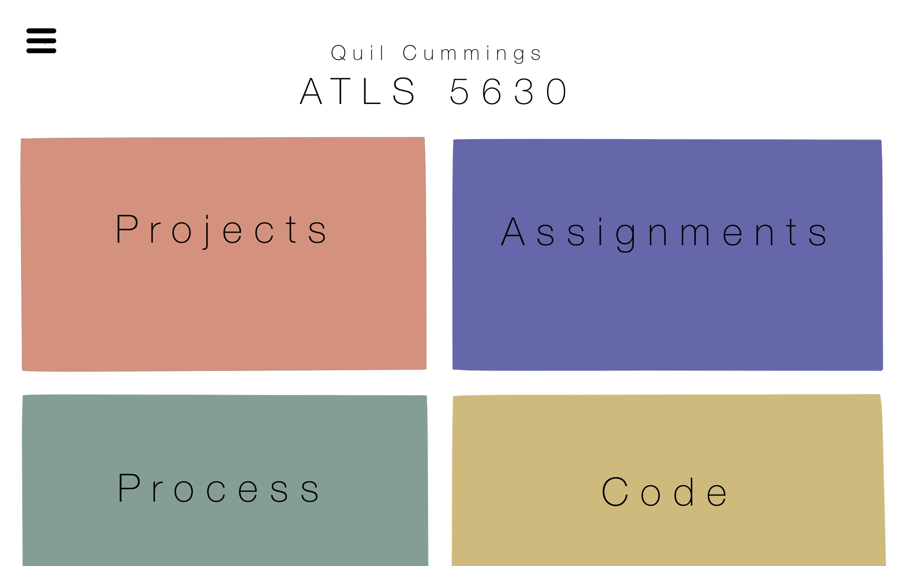
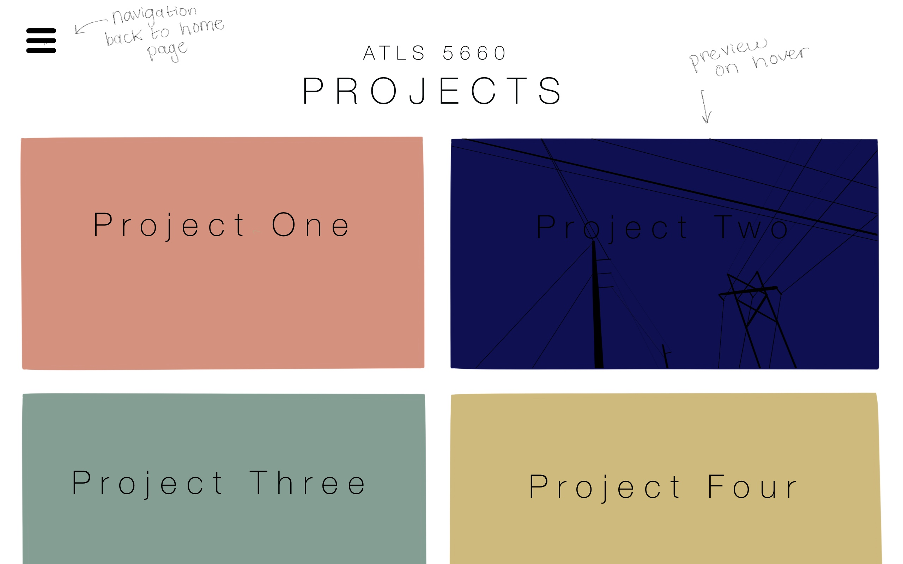
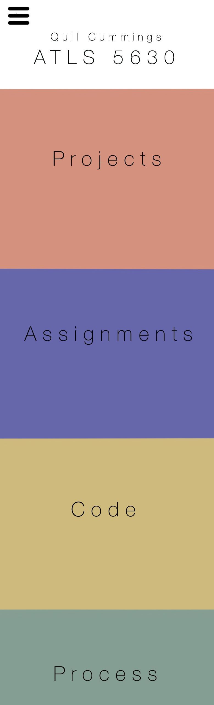

# Class Portal

### Milestone One

I really want my class portal to be simple and easy to navigate, so in my design I tried to keep things straightforward and clean. Overall, I wanted it to look nice, while not being a distraction from the projects that it’s displaying. To make this design work for mobile, it will require some reordering and rearranging. So, as a screen gets smaller the four sections will shrink down and move closer, and then if the screen is a mobile sized I will have it reorder to be top down instead of side by side. 
 
My design has a menu button at the top corner for easy access to switch between the pages. (I might remove it on the main page since the links will be in the body of the web page.) Each of the pages will be very similar, displaying the relevant information in the same format that I’ve mocked up below. 

Color and font were important to me, and I tried to pick both colors and fonts that would be nice to look at without being too flashy or aggressive. I used a pantone palette to choose the color and Helvetica thinned out with some extra kerning for the font, but these both might change over the course of the semester. 

