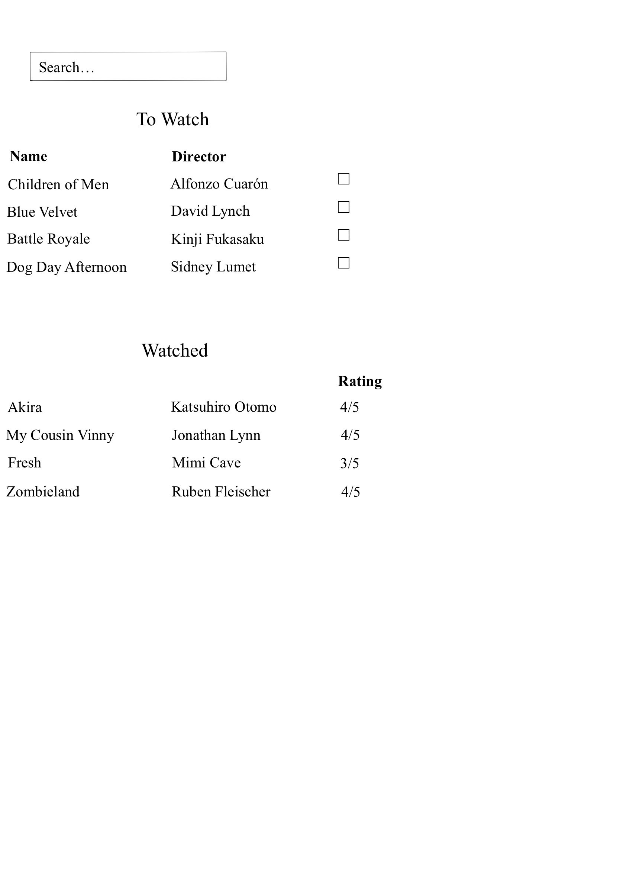
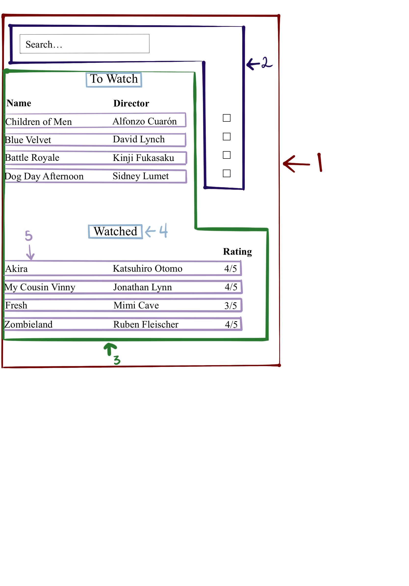

# Assignment 6

1 — Complete table — The entire set of components

2 — User input — Search/Mark as watched

3 — Data table — The table containing the data. Filterable based on user input.

4 — Headings — Category headings

5 — Row — A row for each movie

Hierarchy

	Complete Table
		 User Input
		 Data table
			  Headings
			  Row

State
	
	The search text
	Whether they have watched it or not (Check box)

	
The app will have to keep track of what text the user has entered and if it appears in the list of movies, as well as whether they have watched the movie or not. If they have watched it, it will have to be moved down to a separate category. 

The data table would be the best place for the state to go. The data needs to be filtered and modified based on the search text and checkbox input. None of the other components need the user input data to display accurate information.
