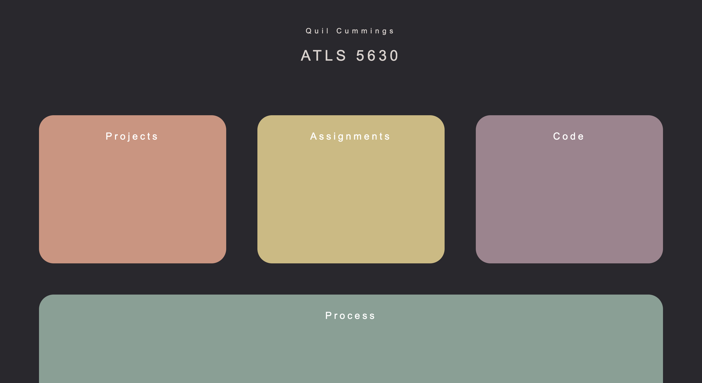
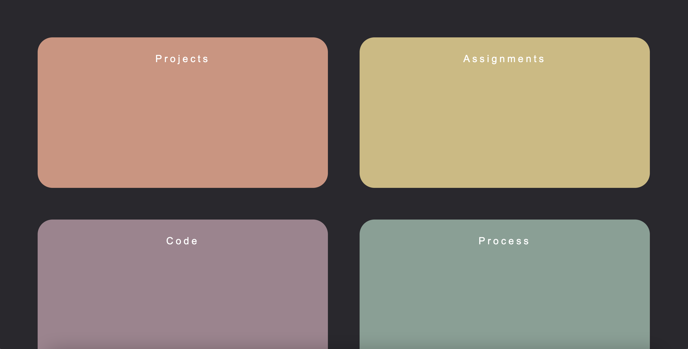
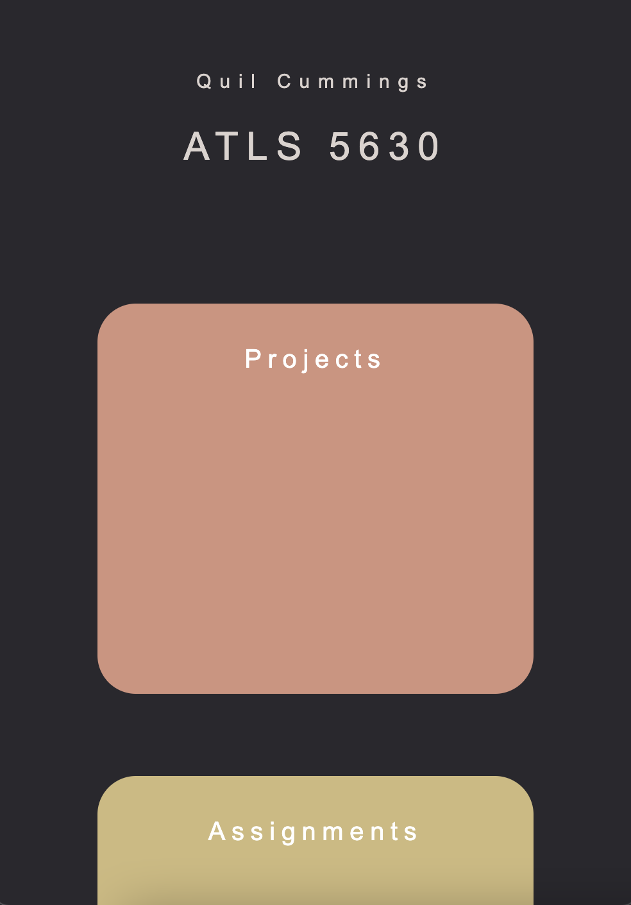

# Class Portal

### Milestone One

I have never worked extensively with html or css so this was more difficult than I had anticipated it being. It definitely still looks pretty juvenile and unprofessional. There were some things that I wanted to add but haven't gotten to yet, such as links to my GitHub and LinkedIn, so I definitely plan to continue to add onto it until it's completely polished.

I ended up changing a lot of the colors from my original plan, but I kept the basic layout for now, with the addition of rounded edges to make the whole thing look a bit smoother. The layout of the boxes was hard to get laid out just right without sacrificing the sizes or adding too much padding between them, but they are dynamic based on the size of the screen and they wrap like I wanted them to.

I tested this on Chrome on Windows and Mac, and again on Safari, and all seemed to work consistently.

Link to my class portal - https://quilcummings.github.io/class-portal-main/
