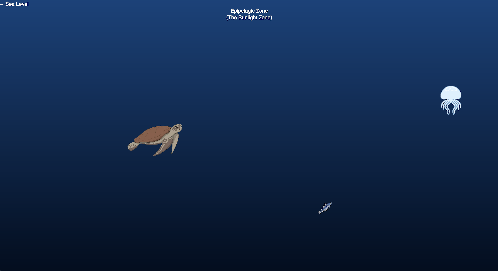

This project was really fun to work on, and creatively I think I achieved what I set out to do. I did end up sacrificing almost all of my stretch goals, but despite having no real animations or time to draw out the objects I was still mostly happy with how it turned out.
  
One thing I will say is that on the technical side I felt as if I was lacking a bit. The code itself is messier than I’d like, and I was hardcoding some things that probably could have been done in smarter, more elegant ways.

Getting the fish to move towards the mouse while still moving in the direction they were facing was more challenging than I had been expecting. The movement part was easy, but the rotation took some finagling. It felt good when I finally got it working. I also spent a long time trying to find a better way to check which object was clicked on, but eventually gave up. I think this would have been easier if I had been making the objects elements on the page, rather than just images on the canvas. In the end, I just stuck with for loops to check the position every time the mouse was clicked. Certainly not the most efficient way to do it, but it works.

Overall, I’m happy with it. It was definitely a learning experience, and if I were to do something like this again with p5.js I would try to figure out instance mode from the start so some of the integration would be a little smoother. If I were to go back and add to it, I would probably work on changing the fonts around, making the gradient smoother, and possibly drawing out each of the fish. Additionally, I would try to refactor my code to be a little cleaner and more efficient. 

https://quilcummings.github.io/class-portal-main/Project1/index.html

