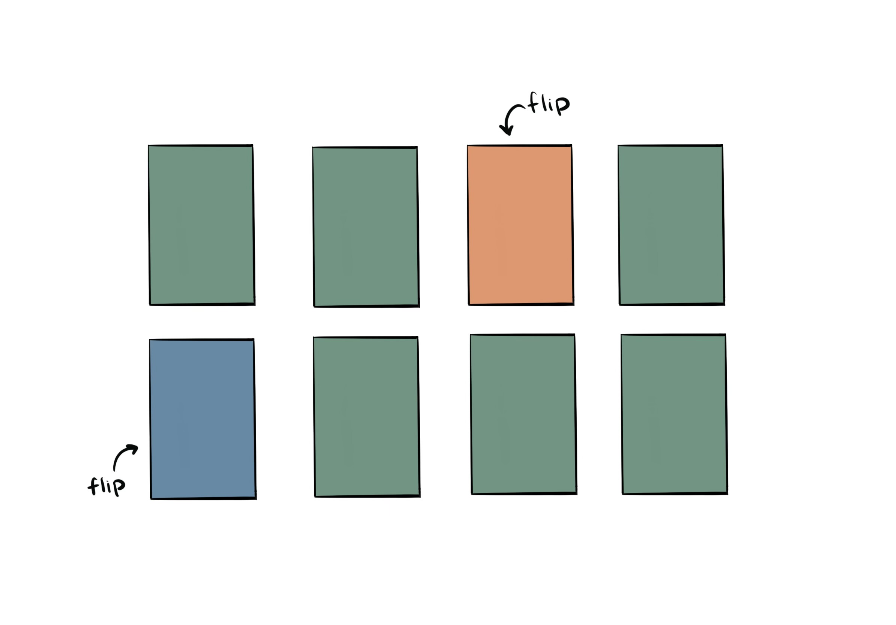
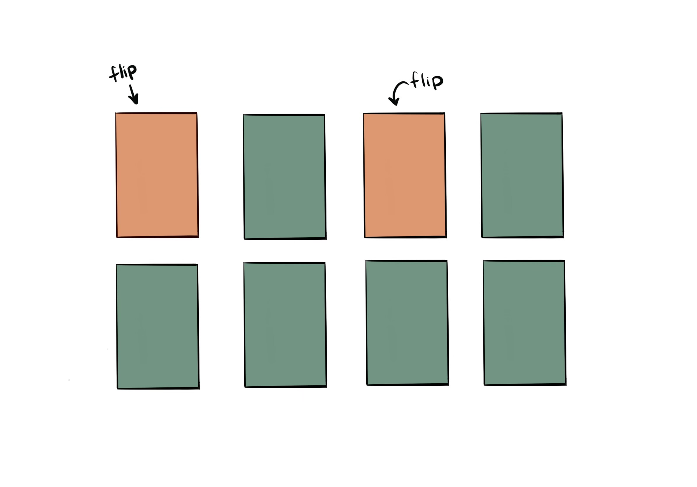
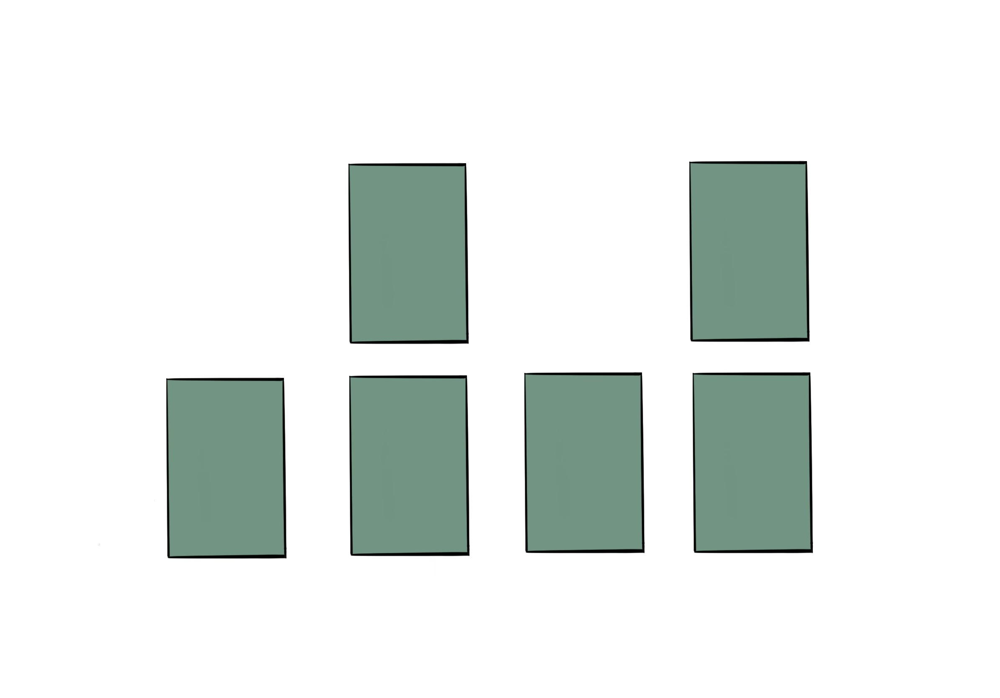

# Project Three

### Milestone Two

We haven't had a lot of time to work on this yet, so we are still mostly in the planning and early development stages of the project. So far the card matching game has been my main focus, although there currently are not any interesting results to show. I created a rough mock up of what it might look like once we have completed it. 

The animation of the card flipping has been fun to work on, and once we get everything working I think it will look really good. There is definitely still a lot of work to do on this, especially with the basic UI and page layout, but overall I think most of our goals are still possible by the due date. There haven't been any huge roadblocks aside from time, so if all goes well we'll have something a lot more complete to show next week!
