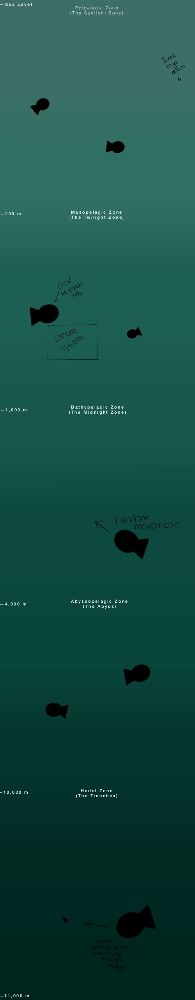

# Project

### Milestone One

For Project One, I plan to design an informational and interactive web page that depicts the layers of the ocean, and the flora and fauna that live on each level. My intended audience would be anyone who is interested in the ocean. I want the web page to respond to the mouse input, and for the user to descend the ocean as they scroll. I was inspired by the Nasa Prospect website and the way the user can scroll down the page seamlessly.

https://nasaprospect.com/ 

Since I’ve worked with p5.js before, I plan to use that library to enhance the user interactions and animations. I want the fish to appear to be swimming, and have them swim towards the mouse position when close enough. I want the user to be able to click on objects on the page to display information about their name, where they're from, etc. Some stretch goals include animating the fish to nibble at the cursor, and having hand drawn objects on the page.
I will likely refer to the p5.js documentation a lot in order to make the animations and interactions look good and work well, as well as fishbase to find and get information on the sea creatures I include.

https://p5js.org/reference/
https://www.fishbase.se/search.php

In order to make this page responsive to different screen sizes, I’ll have the objects being drawn shrink along with the web page, most likely by making their sizes a fraction of the screen width. As another stretch goal, it would be cool to have it be locked to horizontal viewing on cell phones

